# 🗑️ Smart Waste Segregation System

[](https://python.org)
[](https://fastapi.tiangolo.com)
[](https://ultralytics.com)
[](https://ai.google.dev)
[](https://azure.microsoft.com)
[](LICENSE)

> **An AI-powered waste classification system that helps users properly segregate waste into 4 categories using Computer Vision and Generative AI.**

---

## 📋 Table of Contents

- [Overview](#-overview)
- [Problem Statement](#-problem-statement)
- [Solution](#-solution)
- [Features](#-features)
- [System Architecture](#-system-architecture)
- [Tech Stack](#-tech-stack)
- [Waste Categories](#-waste-categories)
- [API Documentation](#-api-documentation)
- [Installation](#-installation)
- [Usage](#-usage)
- [Model Training](#-model-training)
- [Deployment](#-deployment)
- [Project Structure](#-project-structure)
- [Team](#-team)

---

## 🎯 Overview

The **Smart Waste Segregation System** is an intelligent waste classification application that uses **YOLOv8** object detection and **Google Gemini AI** to identify waste items and recommend the correct dustbin for disposal. The system provides real-time classification with educational awareness tips to promote environmental consciousness.

---

## 🔴 Problem Statement

Improper waste segregation leads to:
- 🌍 **Environmental pollution** - Mixed waste contaminates recycling streams
- 💰 **Economic losses** - Recyclable materials end up in landfills
- ☠️ **Health hazards** - Hazardous waste mixed with regular garbage
- 🏭 **Inefficient processing** - Waste treatment plants struggle with unsorted waste

**Only 5% of India's waste is recycled** due to poor segregation at source.

---

## ✅ Solution

Our AI-powered system provides:
- 📸 **Instant Classification** - Upload an image, get results in seconds
- 🎨 **Color-Coded Dustbins** - Clear visual indication (Blue/Green/Red/Grey)
- 📚 **Educational Tips** - AI-generated awareness about proper disposal
- ⚠️ **Safety Warnings** - Special handling instructions for hazardous items

---

## ✨ Features

| Feature | Description |
|---------|-------------|
| 🔍 **Dual AI System** | Gemini Vision (primary) + YOLOv8 (fallback) for maximum accuracy |
| 🎯 **4-Class Detection** | RECYCLABLE, ORGANIC, HAZARDOUS, GENERAL waste |
| 💡 **Smart Tips** | AI-generated disposal instructions and environmental facts |
| 📱 **Responsive UI** | Works on desktop, tablet, and mobile devices |
| ⚡ **Real-time** | Classification results in under 2 seconds |
| 🔒 **Safe Defaults** | Unknown items default to HAZARDOUS for safety |

---

## 🏗️ System Architecture

### High-Level Architecture

```mermaid
graph TB
    subgraph "Frontend"
        A[📱 Web Interface] --> B[Upload Image]
        B --> C[Display Results]
    end
    
    subgraph "Backend API"
        D[FastAPI Server] --> E{Gemini Vision}
        E -->|Success| F[Return Classification]
        E -->|Fail| G[YOLOv8 Model]
        G --> F
    end
    
    subgraph "AI Models"
        H[Gemini 1.5 Flash] --> I[Vision Classification]
        J[YOLOv8 Nano] --> K[Object Detection]
    end
    
    A --> D
    F --> C
```



### Classification Flow

```mermaid
flowchart TD
    A[📷 User Uploads Image] --> B[Image Validation]
    B --> C{Valid Format?}
    C -->|No| D[❌ Error: Invalid Format]
    C -->|Yes| E[🔍 Try Gemini Vision AI]
    
    E --> F{Gemini Available?}
    F -->|Yes| G[✅ Gemini Classification]
    F -->|No| H[⚠️ Fallback to YOLO]
    
    H --> I[YOLOv8 Detection]
    I --> J{Confidence > 65%?}
    J -->|Yes| K[Use Prediction]
    J -->|No| L[Smart Correction]
    
    G --> M[🎨 Get Dustbin Color]
    K --> M
    L --> M
    
    M --> N[💡 Generate Awareness Tip]
    N --> O[📤 Return Response]
    
    O --> P[🗑️ Display Result to User]
```



### Data Flow Diagram

```mermaid
sequenceDiagram
    participant U as 👤 User
    participant F as 🌐 Frontend
    participant A as ⚙️ API Server
    participant G as 🤖 Gemini AI
    participant Y as 🔍 YOLOv8

    U->>F: Upload waste image
    F->>A: POST /api/classify
    A->>G: Classify with Vision AI
    
    alt Gemini Success
        G-->>A: Category + Confidence
    else Gemini Unavailable
        A->>Y: Run YOLO detection
        Y-->>A: Predictions
    end
    
    A->>A: Generate awareness tip
    A-->>F: Classification result
    F-->>U: Display dustbin + tip
```



---

## 🛠️ Tech Stack

### Backend
| Technology | Purpose |
|------------|---------|
|  | Core programming language |
|  | High-performance API framework |
|  | Lightning-fast ASGI server |
|  | Production-grade server |

### AI/ML
| Technology | Purpose |
|------------|---------|
|  | Object detection model |
|  | Vision AI classification |
|  | Deep learning framework |
|  | Image processing |

### Frontend
| Technology | Purpose |
|------------|---------|
|  | Structure |
|  | Styling |
|  | Interactivity |

### Deployment
| Technology | Purpose |
|------------|---------|
|  | Cloud hosting |
|  | CI/CD pipeline |

---

## 🗑️ Waste Categories

| Category | Dustbin | Color | Examples |
|----------|---------|-------|----------|
| **RECYCLABLE** | 🔵 Blue | `#2196F3` | Plastic bottles, glass, metal cans, cardboard, paper |
| **ORGANIC** | 🟢 Green | `#4CAF50` | Food scraps, fruit peels, leaves, garden waste, wood |
| **HAZARDOUS** | 🔴 Red | `#F44336` | Batteries, chemicals, bulbs, paint, medical waste |
| **GENERAL** | ⚫ Grey | `#9E9E9E` | Chip bags, tissues, styrofoam, mixed plastics |

### Visual Guide

```
┌─────────────────────────────────────────────────────────────────┐
│                    WASTE SEGREGATION GUIDE                       │
├─────────────────────────────────────────────────────────────────┤
│                                                                  │
│   🔵 BLUE BIN          🟢 GREEN BIN        🔴 RED BIN           │
│   ───────────          ───────────         ─────────            │
│   ♻️ Recyclable        🌿 Organic          ☠️ Hazardous         │
│                                                                  │
│   • Plastic            • Food waste        • Batteries          │
│   • Paper              • Fruit peels       • E-waste            │
│   • Glass              • Vegetables        • Chemicals          │
│   • Metal              • Garden waste      • Paint              │
│   • Cardboard          • Tea bags          • Bulbs              │
│                                                                  │
│                    ⚫ GREY BIN                                   │
│                    ──────────                                    │
│                    🗑️ General Waste                              │
│                                                                  │
│                    • Chip packets                                │
│                    • Tissues                                     │
│                    • Styrofoam                                   │
│                    • Mixed waste                                 │
│                                                                  │
└─────────────────────────────────────────────────────────────────┘
```

---

## 📡 API Documentation

### Base URL
```
https://waste-classifier-ashmit.azurewebsites.net
```

### Endpoints

#### 1. Health Check
```http
GET /health
```

**Response:**
```json
{
  "status": "healthy",
  "model_loaded": true,
  "model_path": "/app/backend/model/best.pt",
  "timestamp": "2026-02-11T12:00:00.000Z"
}
```

#### 2. Classify Waste
```http
POST /api/classify
Content-Type: multipart/form-data
```

**Request:**
| Parameter | Type | Description |
|-----------|------|-------------|
| `file` | File | Image file (JPG, PNG, WEBP) |

**Response:**
```json
{
  "success": true,
  "category": "RECYCLABLE",
  "confidence": 0.8547,
  "dustbin_color": "blue",
  "dustbin_icon": "recycle",
  "explanation": "This plastic bottle can be recycled...",
  "safety_warning": "",
  "is_safe_classification": true,
  "detected_item": "plastic_bottle",
  "timestamp": "2026-02-11T12:00:00.000Z",
  "model_used": "Gemini Vision AI"
}
```

#### 3. Get Categories
```http
GET /api/categories
```

**Response:**
```json
{
  "categories": [
    {
      "name": "ORGANIC",
      "dustbin_color": "green",
      "icon": "leaf",
      "description": "Organic waste that decomposes naturally..."
    },
    {
      "name": "RECYCLABLE",
      "dustbin_color": "blue",
      "icon": "recycle",
      "description": "Materials that can be reprocessed..."
    },
    {
      "name": "HAZARDOUS",
      "dustbin_color": "red",
      "icon": "warning",
      "description": "Waste that poses risks to health..."
    }
  ]
}
```

---

## 🚀 Installation

### Prerequisites
- Python 3.11+
- Git
- (Optional) NVIDIA GPU with CUDA for training

### 1. Clone Repository
```bash
git clone https://github.com/AshmitThakur23/waste-classifier.git
cd waste-classifier
```

### 2. Create Virtual Environment
```bash
python -m venv .venv

# Windows
.venv\Scripts\activate

# Linux/Mac
source .venv/bin/activate
```

### 3. Install Dependencies
```bash
pip install -r requirements.txt
```

### 4. Set Environment Variables
Create `backend/.env`:
```env
GEMINI_API_KEY=your_gemini_api_key_here
MODEL_PATH=model/best.pt
CONFIDENCE_THRESHOLD=0.65
```

### 5. Run the Application
```bash
cd backend
uvicorn app:app --host 0.0.0.0 --port 8000 --reload
```

### 6. Open Browser
```
http://localhost:8000
```

---

## 📖 Usage

### Web Interface

1. **Open the app** in your browser
2. **Click "Upload Image"** or drag & drop a waste image
3. **Wait 1-2 seconds** for AI classification
4. **View results:**
   - Waste category (RECYCLABLE/ORGANIC/HAZARDOUS/GENERAL)
   - Correct dustbin color
   - Confidence score
   - AI-generated disposal tips

### API Usage (Python)

```python
import requests

# Classify an image
with open("waste_image.jpg", "rb") as f:
    response = requests.post(
        "http://localhost:8000/api/classify",
        files={"file": f}
    )
    
result = response.json()
print(f"Category: {result['category']}")
print(f"Dustbin: {result['dustbin_color']}")
print(f"Confidence: {result['confidence']:.2%}")
```

### API Usage (cURL)

```bash
curl -X POST "http://localhost:8000/api/classify" \
  -H "Content-Type: multipart/form-data" \
  -F "file=@waste_image.jpg"
```

---

## 🧠 Model Training

### Dataset
- **Total Images:** 9,156 training + 1,000 validation
- **Classes:** 4 (RECYCLABLE, ORGANIC, HAZARDOUS, GENERAL)
- **Source:** Custom collected + Roboflow datasets

### Training Configuration
```python
model = YOLO('yolov8n.pt')  # Nano model

model.train(
    data='dataset/data.yaml',
    epochs=50,
    batch=8,
    imgsz=416,
    device=0,  # GPU
    workers=0,
    patience=10,
    optimizer='AdamW',
    lr0=0.01,
    amp=True,  # Mixed precision
)
```

### Model Performance

| Metric | Value |
|--------|-------|
| mAP@50 | 53.2% |
| Precision | 56.2% |
| Recall | 52.6% |
| Inference Time | ~50ms |

### Class Distribution
```
RECYCLABLE  ████████████████████████████ 65%
GENERAL     ████████████ 19%
ORGANIC     ██████ 11%
HAZARDOUS   ███ 5%
```

---

## ☁️ Deployment

### Azure App Service

1. **Create Web App** in Azure Portal
2. **Configure:**
   - Runtime: Python 3.11
   - OS: Linux
   - Plan: Basic B1

3. **Set Startup Command:**
```bash
cd backend && python3 -m gunicorn app:app -c gunicorn.conf.py
```

4. **Connect GitHub** via Deployment Center

5. **Set Environment Variables:**
   - `GEMINI_API_KEY`: Your Gemini API key
   - `SCM_DO_BUILD_DURING_DEPLOYMENT`: true

### Environment Variables

| Variable | Description | Required |
|----------|-------------|----------|
| `GEMINI_API_KEY` | Google Gemini API key | Yes |
| `MODEL_PATH` | Path to YOLO model | No (default: model/best.pt) |
| `CONFIDENCE_THRESHOLD` | Min confidence for safe classification | No (default: 0.65) |

---

## 📁 Project Structure

```
waste-classifier/
├── 📁 backend/
│   ├── 📄 app.py              # FastAPI main application
│   ├── 📄 utils.py            # Utility functions
│   ├── 📄 gemini_service.py   # Gemini AI integration
│   ├── 📄 gunicorn.conf.py    # Gunicorn configuration
│   ├── 📄 requirements.txt    # Backend dependencies
│   ├── 📄 .env.example        # Environment template
│   └── 📁 model/
│       └── 📄 best.pt         # Trained YOLOv8 model (18MB)
│
├── 📁 frontend/
│   ├── 📄 index.html          # Main HTML page
│   ├── 📄 style.css           # Styles
│   ├── 📄 script.js           # Frontend logic
│   └── 📁 images/             # Static images
│
├── 📁 training/
│   ├── 📄 train.py            # Training script
│   ├── 📄 remap_labels.py     # Dataset preprocessing
│   └── 📁 dataset/            # Training data (not in repo)
│
├── 📄 requirements.txt        # Root dependencies for Azure
├── 📄 startup.sh              # Azure startup script
├── 📄 Dockerfile              # Container configuration
├── 📄 .gitignore              # Git ignore rules
└── 📄 README.md               # This file
```

---

## 🔮 Future Enhancements

- [ ] 📱 Mobile app (React Native)
- [ ] 🗣️ Voice-based classification
- [ ] 📊 Analytics dashboard
- [ ] 🌐 Multi-language support
- [ ] 📍 Nearby recycling center locator
- [ ] 🎮 Gamification (rewards for proper segregation)

---

## 👥 Team

| Name | Role | GitHub |
|------|------|--------|
| Ashmit Thakur | Full Stack Developer | [@AshmitThakur23](https://github.com/AshmitThakur23) |

---

## 📄 License

This project is licensed under the MIT License - see the [LICENSE](LICENSE) file for details.

---

## 🙏 Acknowledgments

- [Ultralytics](https://ultralytics.com) for YOLOv8
- [Google](https://ai.google.dev) for Gemini AI
- [FastAPI](https://fastapi.tiangolo.com) for the amazing framework
- [Roboflow](https://roboflow.com) for dataset tools

---

<div align="center">

**Made with ❤️ for a Cleaner Planet 🌍**

[](https://github.com/AshmitThakur23/waste-classifier)

</div>
